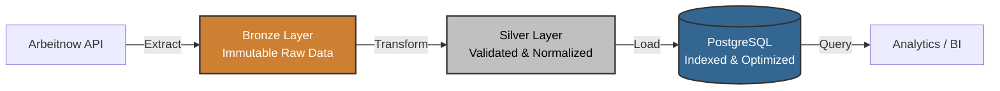

# Arbeitnow Jobs ETL Pipeline (Bronze → Silver → PostgreSQL)

An end-to-end **ETL pipeline** that extracts job postings from the Arbeitnow Job Board API, cleans and transforms the data, and loads it into a PostgreSQL database using modern PostgreSQL features (MERGE, generated columns, partial indexes).

---

## Project Overview

This project implements a layered data architecture:

## Dashboard Preview

### Jobs by Company


### Jobs by City


### Seniority Distribution


## Insights

- 73% of jobs are on-site
- Hamburg and Munich have the highest concentration
- Senior roles dominate the dataset

### Layers

- **Bronze Layer**
  - Raw JSON data extracted from API
  - Stored as `data/bronze_jobs.json`

- **Silver Layer**
  - Cleaned, normalized, structured data
  - Stored as `data/silver_jobs.csv`

- **Database Layer**
  - PostgreSQL table: `jobs_silver`
  - Indexed and optimized for analytics
  - Uses `MERGE` for upserts

---

## Features

- API extraction with error handling  
- Encoding fixes (UTF-8 / Latin1 / CP1252 issues)  
- HTML cleaning & entity decoding  
- Data normalization  
- Slug parsing (extract job_id)  
- Location splitting (city, region, country)  
- Timestamp parsing  
- PostgreSQL MERGE support  
- Generated columns  
- Partial indexing for recent jobs  
- Dockerized PostgreSQL  
- Environment-based configuration  

---

## Tech Stack

- Python 3.11+
- PostgreSQL 16/17
- psycopg (v3)
- Docker & Docker Compose
- python-dotenv
- Regex & HTML parsing

---

## Project Structure
```
.
├── etl/
│ ├── extract.py
│ ├── transform.py
│ └── load.py
│
├── data/
│ ├── bronze_jobs.json
│ └── silver_jobs.csv
|
├── images/
│ ├── Jobs by city.png
│ ├── Jobs by company.png
| └── Jobs by role.png
|
├── tests/
│ ├── tests_all_connections.py
│ └── test_transform.py
|
├── docker-compose.yml
├── main.py
├── jobs.pbix
├── requirements.txt
├── .env
└── README.md
```

---

## Setup Instructions

### Clone the Repository

```bash
git clone "https://github.com/MoaviaMahmood/Jobs_etl"
cd jobs-etl
```

## Start PostgreSQL with Docker
```bash
docker compose up -d
```

## Check if the container is running:
```bash
docker ps
```

## Install Python Dependencies
```bash
pip install -r requirements.txt
```

## Run the Pipeline
```bash
python main.py
```

Pipeline steps:

- Extract jobs from API
- Save Bronze JSON
- Transform to Silver CSV
- Create PostgreSQL table
- Load data using MERGE

## Data Cleaning Logic
## Slug:
- Extracts numeric job_id
- Converts slug to readable title

Example:

senior-data-engineer-12345
→ slug_title: "senior data engineer"
→ job_id: "12345"

### Description Cleaning

- Fix encoding issues
- Decode HTML entities
- Preserve bullet points
- Remove HTML tags
- Remove Arbeitnow footer
- Normalize whitespace

## Remote Field

Converts multiple formats into binary:
```bash
| Input  | Output |
|--------|--------|
| true   | 1      |
| false  | 0      |
| yes    | 1      |
| no     | 0      |

```

## Created Date

Converts UNIX timestamp into:
- created_at (timestamp)
- created_date (date)
- created_year
- created_month

## PostgreSQL Table Schema

Table: jobs_silver
```bash
| Column              | Type           | Description               |
|---------------------|----------------|---------------------------|
| job_id              | TEXT (PK)      | Extracted from slug       |
| title               | TEXT           | Cleaned job title         |
| description         | TEXT           | Cleaned job description   |
| description_length  | INT            | Generated column          |
| remote              | INT            | 0/1 flag                  |
| city                | TEXT           | Extracted location        |
| region              | TEXT           | Extracted location        |
| country             | TEXT           | Extracted location        |
| created_date        | DATE           | Parsed from timestamp     |
| loaded_at           | TIMESTAMP      | ETL load time             |

```

### Indexes

- idx_created_date
- idx_company_name
- idx_remote
- idx_recent_jobs (partial index for recent jobs)

### Upsert Logic (PostgreSQL MERGE)

- If job_id exists → UPDATE
- If job_id does not exist → INSERT

Efficient and production-ready.

## Test Database Connection
```bash
python test_connection.py
```

## Example Queries
Get Recent Remote Jobs
```bash
SELECT title, company_name, city
FROM jobs_silver
WHERE remote = 1
ORDER BY created_date DESC;
```
Top Hiring Companies
```bash
SELECT company_name, COUNT(*) as total_jobs
FROM jobs_silver
GROUP BY company_name
ORDER BY total_jobs DESC;
```

## Future Improvements

- Add Gold layer (aggregated analytics)
- Add Airflow orchestration
- Add incremental loading
- Add logging to file
- Add unit tests
- Add CI/CD pipeline
- Add data validation (Great Expectations)


